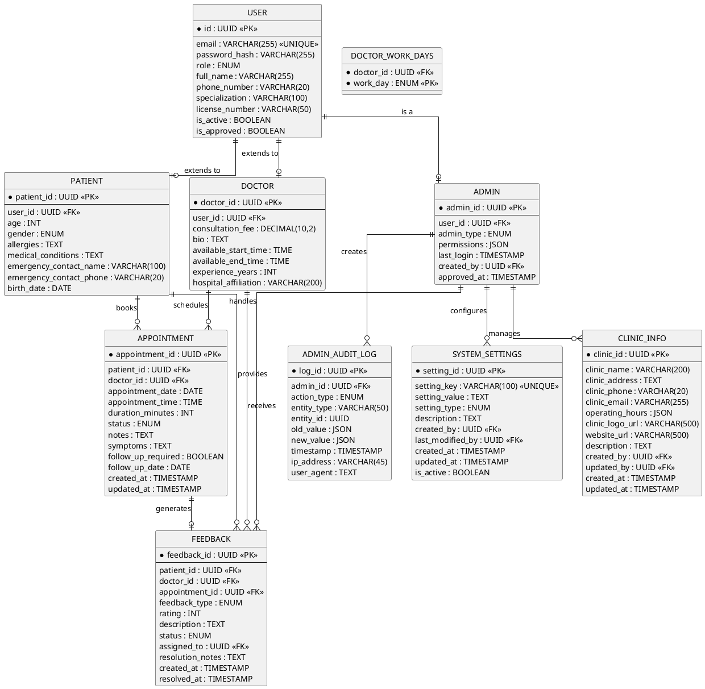

Here is the ERD translated into PlantUML syntax based on the actual codebase implementation:

```plantuml
@startuml
' hide the spot
hide circle

' avoid problems with angled crows feet
skinparam linetype ortho

entity "USER" {
  * id : UUID <<PK>>
  --
  email : VARCHAR(255) <<UNIQUE>>
  password_hash : VARCHAR(255)
  role : ENUM
  full_name : VARCHAR(255)
  phone_number : VARCHAR(20)
  specialization : VARCHAR(100)
  license_number : VARCHAR(50)
  is_active : BOOLEAN
  is_approved : BOOLEAN
}

entity "PATIENT" {
  * patient_id : UUID <<PK>>
  --
  user_id : UUID <<FK>>
  age : INT
  gender : ENUM
  allergies : TEXT
  medical_conditions : TEXT
  emergency_contact_name : VARCHAR(100)
  emergency_contact_phone : VARCHAR(20)
  birth_date : DATE
}

entity "DOCTOR" {
  * doctor_id : UUID <<PK>>
  --
  user_id : UUID <<FK>>
  consultation_fee : DECIMAL(10,2)
  bio : TEXT
  available_start_time : TIME
  available_end_time : TIME
  experience_years : INT
  hospital_affiliation : VARCHAR(200)
}

entity "APPOINTMENT" {
  * appointment_id : UUID <<PK>>
  --
  patient_id : UUID <<FK>>
  doctor_id : UUID <<FK>>
  appointment_date : DATE
  appointment_time : TIME
  duration_minutes : INT
  status : ENUM
  notes : TEXT
  symptoms : TEXT
  follow_up_required : BOOLEAN
  follow_up_date : DATE
  created_at : TIMESTAMP
  updated_at : TIMESTAMP
}

entity "DOCTOR_WORK_DAYS" {
  * doctor_id : UUID <<FK>>
  * work_day : ENUM <<PK>>
  --
}
' Admin entities (future implementation)
entity "ADMIN" {
  * admin_id : UUID <<PK>>
  --
  user_id : UUID <<FK>>
  admin_type : ENUM
  permissions : JSON
  last_login : TIMESTAMP
  created_by : UUID <<FK>>
  approved_at : TIMESTAMP
}

entity "ADMIN_AUDIT_LOG" {
  * log_id : UUID <<PK>>
  --
  admin_id : UUID <<FK>>
  action_type : ENUM
  entity_type : VARCHAR(50)
  entity_id : UUID
  old_value : JSON
  new_value : JSON
  timestamp : TIMESTAMP
  ip_address : VARCHAR(45)
  user_agent : TEXT
}

entity "SYSTEM_SETTINGS" {
  * setting_id : UUID <<PK>>
  --
  setting_key : VARCHAR(100) <<UNIQUE>>
  setting_value : TEXT
  setting_type : ENUM
  description : TEXT
  created_by : UUID <<FK>>
  last_modified_by : UUID <<FK>>
  created_at : TIMESTAMP
  updated_at : TIMESTAMP
  is_active : BOOLEAN
}

entity "CLINIC_INFO" {
  * clinic_id : UUID <<PK>>
  --
  clinic_name : VARCHAR(200)
  clinic_address : TEXT
  clinic_phone : VARCHAR(20)
  clinic_email : VARCHAR(255)
  operating_hours : JSON
  clinic_logo_url : VARCHAR(500)
  website_url : VARCHAR(500)
  description : TEXT
  created_by : UUID <<FK>>
  updated_by : UUID <<FK>>
  created_at : TIMESTAMP
  updated_at : TIMESTAMP
}

entity "FEEDBACK" {
  * feedback_id : UUID <<PK>>
  --
  patient_id : UUID <<FK>>
  doctor_id : UUID <<FK>>
  appointment_id : UUID <<FK>>
  feedback_type : ENUM
  rating : INT
  description : TEXT
  status : ENUM
  assigned_to : UUID <<FK>>
  resolution_notes : TEXT
  created_at : TIMESTAMP
  resolved_at : TIMESTAMP
}

' Current Implementation Relationships
USER ||--o| PATIENT : "extends to"
USER ||--o| DOCTOR : "extends to"
USER ||--o| ADMIN : "is a"
PATIENT ||--o{ APPOINTMENT : "books"
DOCTOR ||--o{ APPOINTMENT : "schedules"

' Admin relationships (for future implementation)
ADMIN ||--o{ ADMIN_AUDIT_LOG : "creates"
ADMIN ||--o{ SYSTEM_SETTINGS : "configures"
ADMIN ||--o{ CLINIC_INFO : "manages"
ADMIN ||--o{ FEEDBACK : "handles"
PATIENT ||--o{ FEEDBACK : "provides"
DOCTOR ||--o{ FEEDBACK : "receives"
APPOINTMENT ||--o| FEEDBACK : "generates"

@enduml
```
